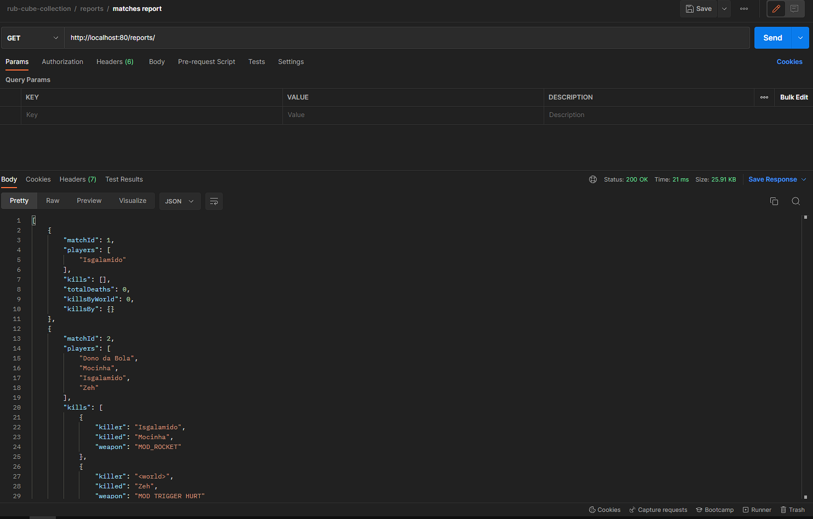
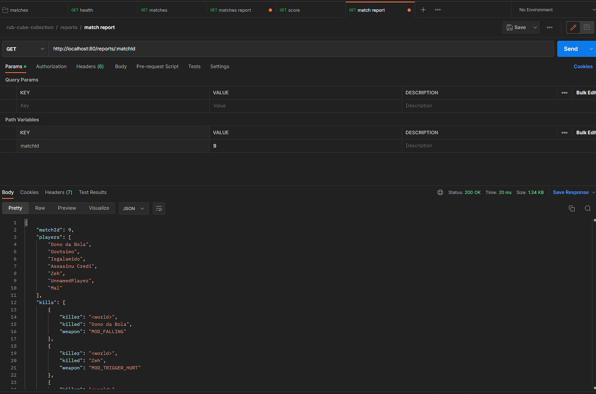
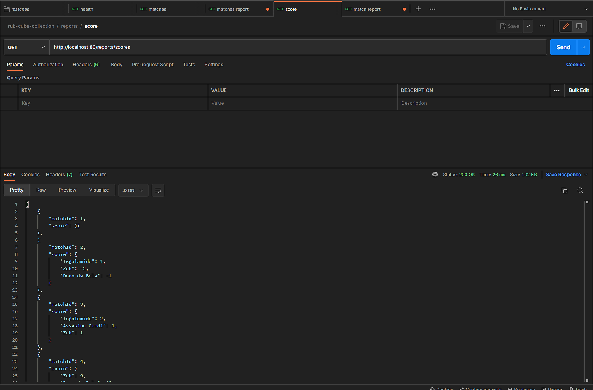

How to run the application?
On the project root, run: node src/index

You can also get a postman collection on the project root, 
then you can easily import on postman and start testing the endpoints.

GET - /reports/

GET - /reports/reports/:matchId

GET - /reports/scores
